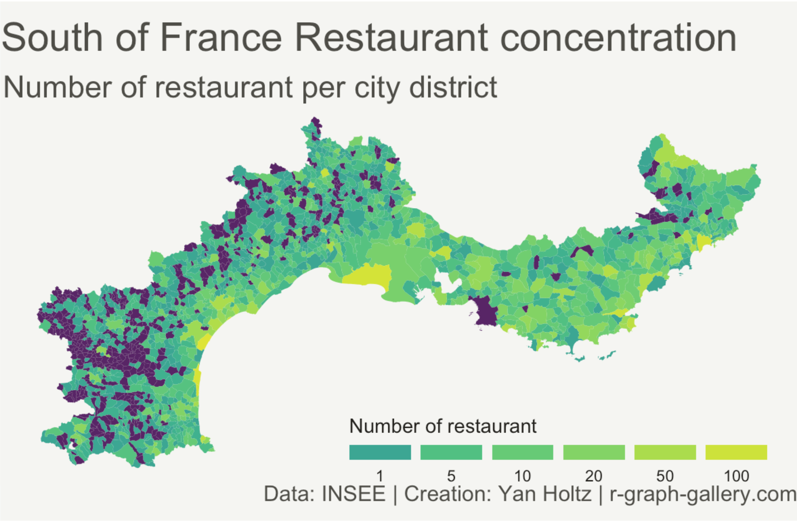
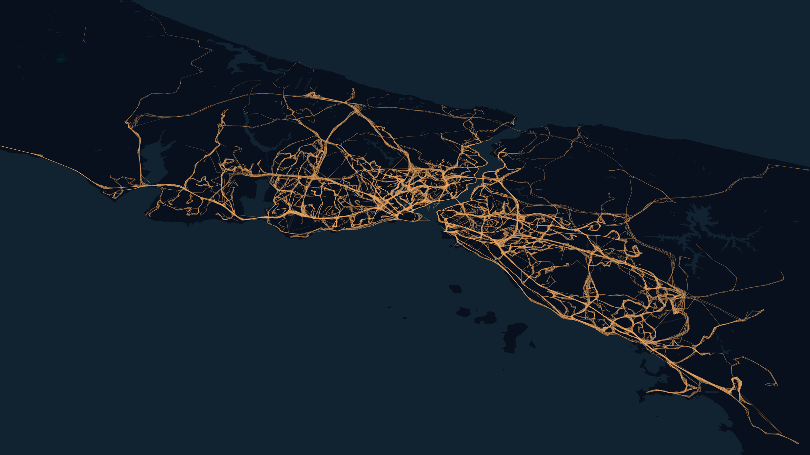

*[English](README.md), [Türkçe](README.tr.md)*

# Türkiye İdari Sınırları

Bu proje Türkiye'nin veri analizinde kullanılabilecek coğrafi koordinatlarındaki eksikliği biraz olsun gidermek ve veriyi tek bir çatı altında toplamak için oluşturulmuştur. Veriler [OpenStreetMap](https://www.openstreetmap.org/) verilerinden [overpass-turbo](http://overpass-api.de/) kullanılarak toplanmış ve [Pentaho Data Integration](https://www.hitachivantara.com/en-us/products/data-management-analytics/pentaho-platform/pentaho-data-integration.html) aracı ile temizlenmiştir. Daha önce oluşturulmuş projeler aşağıdadır;

* [borders-of-turkey](https://github.com/uyasarkocal/borders-of-turkey)
* [Turkey-Maps-GeoJSON](https://github.com/alpers/Turkey-Maps-GeoJSON)
* [tr-geojson](https://github.com/cihadturhan/tr-geojson)

## Veriyi Toplama

### OpenStreetMap - Overpass Api

[Overpass Turbo](http://overpass-turbo.eu/); OpenStreetMap'in sağlamış olduğu OSM verilerinin tarayıcı üzerinden kolayca sorgulanmasını sağlamaya yarayan bir araçtır. Geliştiriciler için [API](https://wiki.openstreetmap.org/wiki/Overpass_API) seçeneği ve [Python](https://github.com/mvexel/overpass-api-python-wrapper)'da kullanılması için bir proje de mevcuttur. 


[OpenStreetMap](https://wiki.openstreetmap.org/wiki/Key:admin_level) dökümanına göre `admin_level` bir ülke sınırları içindeki idari hiyerarşiyi belirlemektedir. 

> The admin_level key describes the administrative level of an object within a government hierarchy. A lower level means higher in the hierarchy.

Türkiye için idari sınırların kodları aşağıdaki gibidir;

* admin_level=2 : Ülke sınırı
* admin_level=4 : İl sınırı
* admin_level=6 : İlçe sınırı
* admin_level=8 : Mahalle sınırı

**[admin_level=8](geojsons/turkey-admin-level-8.geojson) değeri için veriler oldukça eksik. Tamamlamak için [Google Maps API](https://developers.google.com/maps/documentation?hl=tr) veya [Yandex Map API](https://tech.yandex.com.tr/maps/) kullanılabilir.**

Bu sınır kodlarına göre aşağıdaki sorgu çalıştırıldığında katmanlar elde edilebilir.
```
[out:json];
(area["name"="Türkiye"] -> .a;);
(rel(area)["admin_level"="<DEGISTIR>"];);
out geom;
```

Tüm katmanları bir arada görüntülemek için aşağıdaki sorgu çalıştırılmalıdır.
```
[out:json];
(area["name"="Türkiye"] -> .a;);
(rel(area)["type"="boundary"]["boundary"="administrative"];);
out geom;
```

[Overpass Turbo](https://wiki.openstreetmap.org/wiki/ES:Overpass_turbo/GeoJSON) dökümanında belirtildiğine göre ham OSM verisini `geojson` formatına dönüştürmek için **osmtogeojson** adında bir kütüphane kullanılmaktadır. `geojsons` klasöründe bulunan veriler de bu araç kullanılarak üretilmiştir.

> Overpass turbo uses the [osmtogeojson](https://github.com/tyrasd/osmtogeojson) library to convert the raw OSM data output it gets from the Overpass API to GeoJSON.

### TKGM

Coğrafi bilgilere *Tapu ve Kadastro Genel Müdürlüğü*'nün hazırlamış olduğu [Parsel Sorgu](https://parselsorgu.tkgm.gov.tr/) sistemi ile de erişilebilir. [Postman](https://www.postman.com/) kullanarak `tkgm_postman_collection.json` adındaki dosyayı içe aktardıktan sonra *il* > *ilçe* > *mahalle* hiyerarşisinde sorgu yapabilirsiniz. [Mahalle](geojsons/istanbul-neighbourhood-tkgm.geojson) bazındaki veriler eksik ve tatmin edici değil, ek olarak sorgu limiti oldukça düşük ama siz [ne](http://spys.me/proxy.txt) yapacağınızı biliyorsunuz.

### TOPOVT

*Harita Genel Müdürlüğü*'nün sunduğu *[Topoğrafik Vektör Veritabanı Yönetim Sistemi](https://topovt.harita.gov.tr/)* sayesinde *TC Kimlik No* ile giriş yapılarak ayrıntılı verilere erişilebilir. Ek olarak [buradan](https://atlas.harita.gov.tr/) ayrıntılı bir Türkiye Haritası'na erişim sağlayabilirsiniz.

### Pentaho ve Akışlar

Akışları kullanabilmek için [Pentaho PDI](https://sourceforge.net/projects/pentaho/files/Pentaho%209.0/) kurulmalı ve `pentaho-flows` klasöründeki `.ktr` uzantılı dosyalar kullanılmalıdır. Kurulum ve kullanımda sorun yaşamanız halinde mail atabilirsiniz. Oluşturulan akışların benzerleri herhangi bir **ETL** aracıyla rahatlıkla yapılabilir.

* **GeoJSON from TKGM.ktr**: `tkgm_postman_collection.json` içindeki HTTP sorgularının otomatize edilmesi için hazırlanmış bir akıştır. İçinde İstanbulun il kodları kullanılarak TKGM API'a sorgu gönderilmiş ve sonuçları *geojson* olarak kaydedilmiştir.

* **Remove Admin Center.ktr**: `.geojson` dosyalarınlarda bulunan merkez noktalarının temizlenmesi için oluşturulmuş bir akıştır. Farkları aşağıdaki liklere tıklanarak görülebilir;

    * [Merkez noktası olan İstanbul mahalleleri](geojsons/istanbul-admin-level-8.geojson)
    * [Merkez noktaları temizlenmiş İstanbul mahalleleri](geojsons/istanbul-admin-level-8-without-centers.geojson)

## Bu veri ile ne yapılabilir?

Bir yüksek lisans projesinde yaşadığım zorluktan dolayı bu kaynağı oluşturma ihtiyacı hissettim. Aşağıda veri görselleştirme ve analizi için bulduğum örnekleri sıralıyorum;

* Bir `R` [kütüphanesi](https://www.r-graph-gallery.com/327-chloropleth-map-from-geojson-with-ggplot2.html) ile coğrafi koordinatlar kullanılarak ısı haritası çıkarılabilir.

<center></center>

* [İstanbul Büyükşehir Belediyesi](https://data.ibb.gov.tr/)'nin sağlamış olduğu koordinatlar kullanılarak otobüs güzergahlarının haritası çıkarılabilir. [KeplerGL](https://kepler.gl/) kullanılarak yapılan projeye [buradan](https://medium.com/swlh/visualizing-istanbul-bus-traffic-with-python-and-keplergl-a84895788825) erişebilirsiniz.

<center></center>